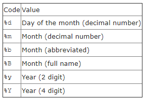
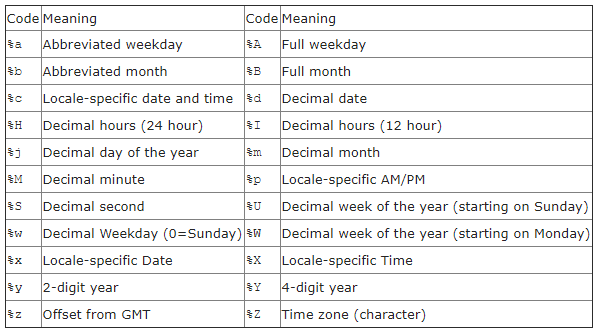
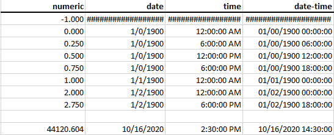
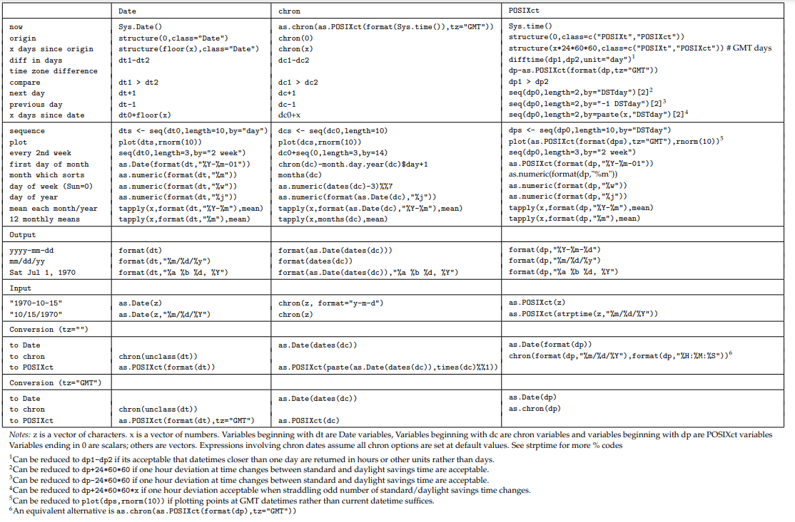

```{r setup, include=FALSE}
knitr::opts_chunk$set()
options(knitr.kable.NA = '-')
```

## Dates and Times in R

list of types: 

- character - safest for import/export

- numeric - necessary for calculations
    - Date
    - POSIX - "portable operating system interface for unix (and other OS's)"
      - POSIXct - you should probably use this
      - POSIXlt - list components
    - {`chron`} - an longstanding R package for easy handling of dates and times
      (and times without dates).

## Formatting Dates for nice output

For a full list see `?strptime` 

Dates



Datetimes



## Working with dates: base R

You can do many simple operations on dates with the usual functions:

- addition, subtraction
- mean, min, max, 
- round, ceiling, floor

You can also generate sequences of dates: 

```{r}
seq(as.Date('2000-6-1'),to=as.Date('2000-8-1'),by='2 weeks')
```

## Working with dates: {`chron`}

Either the [chron manual](https://cran.rstudio.com/web/packages/chron/chron.pdf) 
or [this link to a page at UC-Berkeley](https://statistics.berkeley.edu/computing/r-dates-times)

## Working with dates: {`lubridate`}

See ["Dates and Times" chapter in R for Data Science](https://r4ds.had.co.nz/dates-and-times.html)

There are a couple of things that lubridate makes super easy. 

1. Converting dates from character strings in multiple formats.
2. Operating with time periods.

## Origin

```{r, message = FALSE, warning = FALSE}
library(tidyverse)
library(chron)
library(lubridate)
```


Date: days since 1970-01-01
```{r}
as.numeric(as.Date("1970-01-01"))

```

POSIX: seconds since 1970-01-01 00:00:00 ***UTC***
```{r}
#Compare
as.numeric(as.POSIXct("1970-01-01 00:00:00"))
as.numeric(as.POSIXct("1970-01-01 00:00:00", tz = "America/Chicago"))
as.numeric(as.POSIXct("1970-01-01 00:00:00", tz = "UTC"))
```

## Getting dates into and out of excel

Unless they are stored as characters, we often need to convert the dates from 
an excel import using the `origin` argument.

So, what is excel's origin? After googling .... it depends! probably on your 
version/language of Excel and your operating system[^1]

[^1]: See [the comments in this StackOverflow answer](https://stackoverflow.com/questions/43230470/how-to-convert-excel-date-format-to-proper-date-in-r) and [this R-bloggers post](https://www.r-bloggers.com/2013/08/date-formats-in-r/#:~:text=Date.,date%20is%20January%201%2C%201904.)

Here is how DPI's version of Excel on Windows 10 works:



Fun fact: Excel wrongly assumes that 1900 was a leap year so the numbers from 
March 1, 1900 should all be one less than they are.

## Equivalent Table for R

Note: Origin is taken to be 1970-01-01 00:00:00 UTC

```{r}
tibble(numeric_days = c(-1, 0, .25, .5, .75, 1, 2, 2.75, NA, 18551.6041667)) %>% 
   mutate(
     date = as.Date(numeric_days, origin = "1970-01-01"),
     datetime_days = as.POSIXct(numeric_days, origin = "1970-01-01 00:00:00", tz = "UTC"),
     numeric_sec = numeric_days * 24 * 60 * 60,
     datetime_sec = as.POSIXct(numeric_sec, origin = "1970-01-01 00:00:00", tz = "UTC")
   ) %>% 
  knitr::kable(align = 'r', )
```

## Standards for DPI

*nano-rant*: We should always and everywhere use ISO 8601: YYYY-MM-DD

We don't really have date standards here at DPI, but we usually abbreviate 
school years (and fiscal years) as the 4 digits of the spring term. 

Are there others? Thoughts?

## Converting between Date, chron, and POSIXct



## Cautions

If you are doing calculations, know whether you are dealing with Dates or POSIX
because the answers could be off by a factor of 86,400

TIMEZONES!!!
    - Time zones only affect how date is displayed. 
    - Be careful with times around midnight if you are trying to truncate POSIX
      into a Date ... the safest way is to convert them via an intermediary 
      character variable.
    - Operations that combine date-times, like c(), will often drop the time 
      zone. In that case, the date-times will display in your local time zone.

Know the default way dates are treated by your import functions!
- `utils::read.csv()`
```{r}
str(read.csv('excel-origin-date.csv'))
```
- `readr::read_csv()`
```{r}
str(readr::read_csv('excel-origin-date.csv'))
```
- `readxl::read_excel()`
```{r}
str(readxl::read_excel('excel-origin-date.xlsx'))
```
- `openxlsx::read.xlsx()`
```{r}
str(openxlsx::read.xlsx('excel-origin-date.xlsx'))
```
- `tidyxl::xlsx_cells()`
```{r}
str(tidyxl::xlsx_cells('excel-origin-date.xlsx')[,1:11])
```
- From {`foreign`} 
    - for Stata default is to import Stata Date format variables as Date class
- From {`haven` version 1.0.0}

>Support for date/times has substantially improved:
>
> - `read_dta()` now recognises “%d” and custom date types.
> - `read_sav()` now correctly recognises EDATE and JDATE formats as dates. Variables with format DATE, ADATE, EDATE, JDATE or SDATE are imported as Date variables instead of POSIXct.
> - `write_dta()` and `write_sav()` support writing date/times.
> - Support for `hms()` has been moved into the hms package. Time varibles now have class c("hms", "difftime") and a units attribute with value “secs”.

## Resources

- General/Base R
    - https://cran.r-project.org/doc/Rnews/Rnews_2004-1.pdf
    - https://stats.idre.ucla.edu/r/faq/how-does-r-handle-date-values/
    - https://statistics.berkeley.edu/computing/r-dates-times
    - Chapter 6 in R for Dummies ("Going on a Date with R")
- {`lubridate`}
    - https://blog.exploratory.io/5-most-practically-useful-operations-when-working-with-date-and-time-in-r-9f9eb8a17465
    
    
    